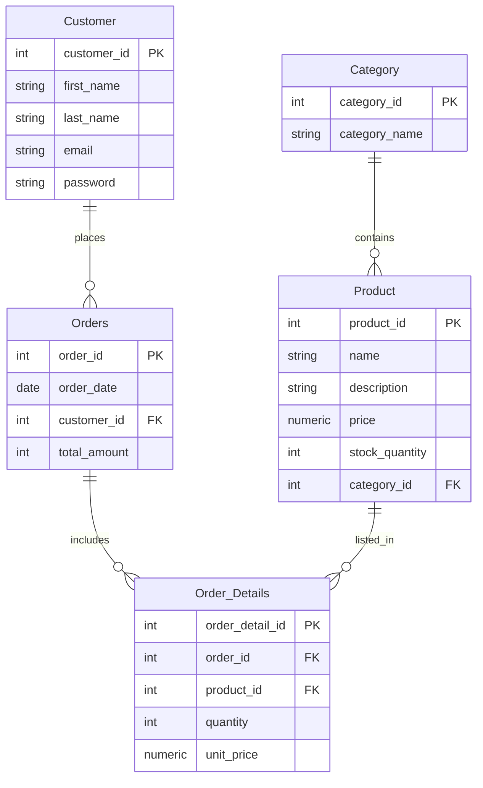

# E-Commerce Database Project

This project contains the SQL schema for a basic e-commerce system including:

- Categories
- Products
- Customers
- Orders
- Order Details

The schema is written using standard SQL and tested on SQL Server.

---

# 📁 **Database Schema (SQL)**

Below is the full SQL schema used in this project.

```sql
CREATE TABLE Category (
    category_id INTEGER,
    category_name VARCHAR(50),
    PRIMARY KEY (category_id)
);

CREATE TABLE Product (
    product_id INTEGER,
    name VARCHAR(50) NOT NULL,
    description VARCHAR(100) NOT NULL,
    price NUMERIC(5,2) NOT NULL CHECK (price >= 0),
    stock_quantity INTEGER NOT NULL CHECK (stock_quantity >= 0),
    category_id INTEGER NOT NULL,
    PRIMARY KEY (product_id),
    FOREIGN KEY (category_id) REFERENCES Category(category_id)
);

CREATE TABLE Customer (
    customer_id INTEGER,
    first_name VARCHAR(20) NOT NULL,
    last_name VARCHAR(20) NOT NULL,
    email VARCHAR(255) NOT NULL,
    password VARCHAR(30) NOT NULL,
    PRIMARY KEY (customer_id)
);

CREATE TABLE Orders (
    order_id INTEGER,
    order_date DATE NOT NULL,
    customer_id INTEGER NOT NULL,
    total_amount INTEGER NOT NULL DEFAULT 0,
    PRIMARY KEY (order_id),
    FOREIGN KEY (customer_id) REFERENCES Customer(customer_id)
);

CREATE TABLE Order_Details (
    order_detail_id INTEGER,
    order_id INTEGER NOT NULL,
    product_id INTEGER NOT NULL,
    quantity INTEGER NOT NULL CHECK (quantity > 0),
    unit_price NUMERIC(5,2) NOT NULL CHECK (unit_price >= 0),
    PRIMARY KEY (order_detail_id),
    FOREIGN KEY (order_id) REFERENCES Orders(order_id),
    FOREIGN KEY (product_id) REFERENCES Product(product_id)
);
```
---

# 🔗 Entity–Relationship Summary

Below is a summary of the relationships between entities:

1. Category → Product

Relationship: One-to-Many (1:N)

Meaning: Each category can contain multiple products.

2. Customer → Orders

Relationship: One-to-Many (1:N)

Meaning: A customer can place multiple orders.

3. Orders → Order_Details

Relationship: One-to-Many (1:N)

Meaning: Each order can contain multiple items.

4. Product → Order_Details

Relationship: One-to-Many (1:N)

Meaning: A product can appear in multiple order lines.

---

## 📌 Entity Relationship Diagram (ERD)



# 📊 SQL Queries / Reports

### 1. Daily Revenue Report for a Specific Date

```sql
SELECT 
    '2025-01-10' AS ReportDate,
    SUM(TotalAmount) AS TotalRevenue
FROM Orders
WHERE OrderDate = '2025-01-10';
```
### 2. Monthly Top-Selling Products

```sql
SELECT TOP 5 
    p.name, 
    od.product_id,
    COUNT(od.product_id) AS SalesCount
FROM Order_Details od
JOIN Product p ON od.product_id = p.product_id
GROUP BY od.product_id, p.name
ORDER BY SalesCount DESC;

```
### 3. Customers with Orders Totaling More Than $500 in the Past Month

```sql
SELECT 
    c.customer_id,
    c.first_name + ' ' + c.last_name AS FullName,
    SUM(o.total_amount) AS total_price
FROM Customer c
JOIN Orders o ON c.customer_id = o.customer_id
WHERE o.order_date BETWEEN '2025-01-01' AND '2025-01-31'
GROUP BY c.customer_id, c.first_name, c.last_name
HAVING SUM(o.total_amount) > 500;


```
### 4. Applying Denormalization on Customer and Order Entities
We can apply denormalization to Customer and Order entities to speed up data retrieval and reduce queries:

Storing data in prebuilt files (JSON or XML)

Combine all customer data and their orders into a single file per customer.

Store the file on disk.

When a customer logs in, fetch the file by ID → faster than querying multiple tables.

Note: Must regenerate the file on any data update.

Application-level caching (RAM or Disk, e.g., Redis / Memcached)

Load customer data and orders into memory or cache.

When a customer logs in, read directly from the cache → extremely fast.

Note: Cache must be updated on any database changes to ensure data accuracy.

---

### 5-Trigger to Automatically Create Sale History on Order Insertion
This trigger automatically generates a sale history record whenever a new order is inserted into the Orders table. It captures details such as the order date, customer, product, quantity, and total amount

```SQL
CREATE TABLE Sale_History (
    sale_id INT IDENTITY(1,1) PRIMARY KEY,
    order_id INT NOT NULL,
    customer_id INT NOT NULL,
    product_id INT NOT NULL,
    quantity INT NOT NULL,
    order_date DATETIME NOT NULL,
    total_amount DECIMAL(10,2) NOT NULL,
    FOREIGN KEY (order_id) REFERENCES Orders(order_id),
    FOREIGN KEY (customer_id) REFERENCES Customer(customer_id),
    FOREIGN KEY (product_id) REFERENCES Product(product_id)
);


CREATE TRIGGER CreateSaleHistory
ON Order_Details
AFTER INSERT
AS
BEGIN

    INSERT INTO Sale_History (
        order_id,
        customer_id,
        product_id,
        quantity,
        order_date,
        total_amount
    )
    SELECT
        i.order_id,
        o.customer_id,
        i.product_id,
        i.quantity,
        o.order_date,
        i.quantity * i.unit_price AS total_amount
    FROM inserted i
    JOIN Orders o 
        ON o.order_id = i.order_id;
END;
GO
```

#### Example Usage (for testing):

```SQL
INSERT INTO Orders (order_id, order_date, customer_id, total_amount)
VALUES (1234, GETDATE(), 1, 0);


INSERT INTO Order_Details (order_detail_id, order_id, product_id, quantity, unit_price)
VALUES (1243, 1234, 11, 3, 40);

SELECT * FROM Order_Details;
SELECT * FROM Sale_History;
```


