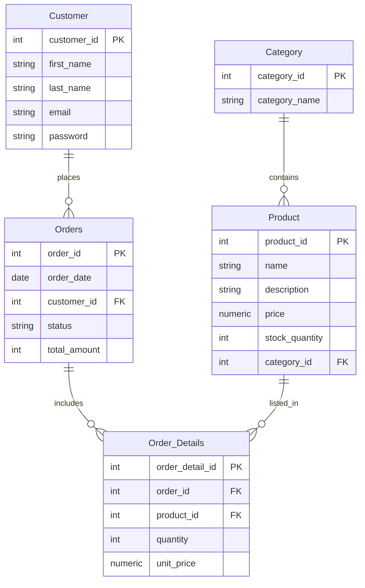

# E-Commerce Database Project

This project contains the SQL schema for a basic e-commerce system including:

- Categories
- Products
- Customers
- Orders
- Order Details

The schema is written using standard SQL and tested on SQL Server.

---

# 📁 **Database Schema (SQL)**

Below is the full SQL schema used in this project.

```sql
CREATE TABLE Category (
    category_id INTEGER,
    category_name VARCHAR(50),
    PRIMARY KEY (category_id)
);

CREATE TABLE Product (
    product_id INTEGER,
    name VARCHAR(50) NOT NULL,
    description VARCHAR(100) NOT NULL,
    price NUMERIC(5,2) NOT NULL CHECK (price >= 0),
    stock_quantity INTEGER NOT NULL CHECK (stock_quantity >= 0),
    category_id INTEGER NOT NULL,
    PRIMARY KEY (product_id),
    FOREIGN KEY (category_id) REFERENCES Category(category_id)
);

CREATE TABLE Customer (
    customer_id INTEGER,
    first_name VARCHAR(20) NOT NULL,
    last_name VARCHAR(20) NOT NULL,
    email VARCHAR(255) NOT NULL,
    password VARCHAR(30) NOT NULL,
    PRIMARY KEY (customer_id)
);

CREATE TABLE Orders (
    order_id INTEGER,
    order_date DATE NOT NULL,
    customer_id INTEGER NOT NULL,
    total_amount INTEGER NOT NULL DEFAULT 0,
    PRIMARY KEY (order_id),
    FOREIGN KEY (customer_id) REFERENCES Customer(customer_id)
);

CREATE TABLE Order_Details (
    order_detail_id INTEGER,
    order_id INTEGER NOT NULL,
    product_id INTEGER NOT NULL,
    quantity INTEGER NOT NULL CHECK (quantity > 0),
    unit_price NUMERIC(5,2) NOT NULL CHECK (unit_price >= 0),
    PRIMARY KEY (order_detail_id),
    FOREIGN KEY (order_id) REFERENCES Orders(order_id),
    FOREIGN KEY (product_id) REFERENCES Product(product_id)
);
```
---

# 🔗 Entity–Relationship Summary

Below is a summary of the relationships between entities:

1. Category → Product

Relationship: One-to-Many (1:N)

Meaning: Each category can contain multiple products.

2. Customer → Orders

Relationship: One-to-Many (1:N)

Meaning: A customer can place multiple orders.

3. Orders → Order_Details

Relationship: One-to-Many (1:N)

Meaning: Each order can contain multiple items.

4. Product → Order_Details

Relationship: One-to-Many (1:N)

Meaning: A product can appear in multiple order lines.

---

## 📌 Entity Relationship Diagram (ERD)



# 📊 SQL Queries / Reports

### 1. Daily Revenue Report for a Specific Date

```sql
SELECT 
    '2025-01-10' AS ReportDate,
    SUM(TotalAmount) AS TotalRevenue
FROM Orders
WHERE OrderDate = '2025-01-10';
```
### 2. Monthly Top-Selling Products

```sql
SELECT TOP 5 
    p.name, 
    od.product_id,
    COUNT(od.product_id) AS SalesCount
FROM Order_Details od
JOIN Product p ON od.product_id = p.product_id
GROUP BY od.product_id, p.name
ORDER BY SalesCount DESC;

```
### 3. Customers with Orders Totaling More Than $500 in the Past Month

```sql
SELECT 
    c.customer_id,
    c.first_name + ' ' + c.last_name AS FullName,
    SUM(o.total_amount) AS total_price
FROM Customer c
JOIN Orders o ON c.customer_id = o.customer_id
WHERE o.order_date BETWEEN '2025-01-01' AND '2025-01-31'
GROUP BY c.customer_id, c.first_name, c.last_name
HAVING SUM(o.total_amount) > 500;


```
### 4. Applying Denormalization on Customer and Order Entities

Reduce the need for joins and speed up frequent queries related to customer orders, especially for reporting, notifications, or analytics.

a) Duplicate key customer info in Orders table

What: Add frequently accessed customer fields (like email, phone_number) directly into the Orders table.

Why: When sending notifications or generating reports, no need to join with Customers.

Example:
```sql
Orders(
    order_id,
    customer_id,
    customer_email,   -- denormalized
    order_date,
    status,
    total_amount
)

```
Trade-off: Updating customer info requires updating multiple rows in Orders.

b) Precomputed order summaries

What: Store aggregated data in the Customers table, e.g., total_orders, last_order_date, total_spent.

Why: Quickly fetch statistics without joining or scanning Orders.

Example:

```sql
Customers(
    customer_id,
    name,
    email,
    total_orders,      -- denormalized
    total_spent,       -- denormalized
    last_order_date    -- denormalized
)
```
Trade-off: Must update these fields whenever a new order is placed.


---

### 5-Trigger to Automatically Create Sale History on Order Insertion
This trigger automatically generates a sale history record whenever a new order is inserted into the Orders table. It captures details such as the order date, customer, product, quantity, and total amount

```SQL
CREATE TABLE Sale_History (
    sale_id INT IDENTITY(1,1) PRIMARY KEY,
    order_id INT NOT NULL,
    customer_id INT NOT NULL,
    product_id INT NOT NULL,
    quantity INT NOT NULL,
    order_date DATETIME NOT NULL,
    total_amount DECIMAL(10,2) NOT NULL,
    FOREIGN KEY (order_id) REFERENCES Orders(order_id),
    FOREIGN KEY (customer_id) REFERENCES Customer(customer_id),
    FOREIGN KEY (product_id) REFERENCES Product(product_id)
);


CREATE TRIGGER CreateSaleHistory
ON Order_Details
AFTER INSERT
AS
BEGIN

    INSERT INTO Sale_History (
        order_id,
        customer_id,
        product_id,
        quantity,
        order_date,
        total_amount
    )
    SELECT
        i.order_id,
        o.customer_id,
        i.product_id,
        i.quantity,
        o.order_date,
        i.quantity * i.unit_price AS total_amount
    FROM inserted i
    JOIN Orders o 
        ON o.order_id = i.order_id;
END;
GO
```

#### Example Usage (for testing):

```SQL
INSERT INTO Orders (order_id, order_date, customer_id, total_amount)
VALUES (1234, GETDATE(), 1, 0);


INSERT INTO Order_Details (order_detail_id, order_id, product_id, quantity, unit_price)
VALUES (1243, 1234, 11, 3, 40);

SELECT * FROM Order_Details;
SELECT * FROM Sale_History;
```
---

### 6- Transaction Lock Demonstration for Product ID 211 in SQL Server

1️⃣ Scenario Overview

We demonstrate how SQL Server handles transaction locks using two separate sessions:

Session 1: Initiates a transaction and locks the row by performing an UPDATE on stock_quantity without changing its value.

Session 2: Attempts to read or update the same row, showing how locks affect concurrent operations.

2️⃣ Session 1: Initiating the Transaction

```sql
BEGIN TRANSACTION;

-- Lock the row without changing the value
UPDATE Product
SET stock_quantity = stock_quantity
WHERE product_id = 211;

```
This creates an exclusive lock on the row for Product ID 211.
No other session can perform updates on this row until this transaction completes.


3️⃣ Session 2: Attempting to Read/Update

```sql
BEGIN TRANSACTION;

-- Attempt to update the same row
UPDATE Product
SET stock_quantity = 100
WHERE product_id = 211;

-- Attempt to read the same row
SELECT * FROM Product
WHERE product_id = 211;
```

4️⃣ Observed Behavior

1. Reading Only:
   - SELECT works normally; locks don’t prevent read operations.

2. Updating Only:
   - UPDATE is blocked until Session 1 commits or rolls back.

3. Update + Select in the Same Transaction:
   - The entire transaction is blocked until Session 1 finishes.

5️⃣ Key Takeaways

- Write operations (UPDATE) are blocked by locks held by other transactions.
- Read operations (SELECT) are generally allowed unless combined with a write in the same transaction.
  Using this technique helps prevent race conditions when multiple sessions try to update the same data concurrently.

# 📊 SQL Queries / Reports

# TASK 1 – Category Product Counts

QUERY

```sql
SELECT c.id,c.name,COUNT(p.id) AS total_products
FROM categories c 
JOIN products p
ON p.category_id = c.id
GROUP BY c.id
ORDER BY total_products DESC;

```

EXPLAIN

```sql
1	SIMPLE	p		ALL					99951	100.00	Using temporary; Using filesort
1	SIMPLE	c		eq_ref	PRIMARY	PRIMARY	4	ecommerce.p.category_id	1	100.00	
```

EXPLAIN ANALYZE

```sql
'-> Sort: total_products DESC  (actual time=187..187 rows=5 loops=1)\n
    -> Table scan on <temporary>  (actual time=187..187 rows=5 loops=1)\n
        -> Aggregate using temporary table  (actual time=187..187 rows=5 loops=1)\n
                    -> Nested loop inner join  (cost=45066 rows=99951) (actual time=0.176..135 rows=100000 loops=1)\n
                                    -> Table scan on p  (cost=10083 rows=99951) (actual time=0.137..32.5 rows=100000 loops=1)\n
                                                    -> Single-row index lookup on c using PRIMARY (id=p.category_id)  (cost=0.25 rows=1) (actual time=876e-6..896e-6 rows=1 loops=100000)\n'

```

ADD INDEX ON PRODUCT(CATEGORY_ID)

EXPLAIN

```sql
1	SIMPLE	p		index	idx_product_category	idx_product_category	4		99951	100.00	Using index; Using temporary; Using filesort
1	SIMPLE	c		eq_ref	PRIMARY	PRIMARY	4	ecommerce.p.category_id	1	100.00	
```

EXPLAIN ANALYZE

```sql
'-> Sort: total_products DESC  (actual time=106..106 rows=5 loops=1)\n
    -> Table scan on <temporary>  (actual time=106..106 rows=5 loops=1)\n
            -> Aggregate using temporary table  (actual time=106..106 rows=5 loops=1)\n
                        -> Nested loop inner join  (cost=45066 rows=99951) (actual time=0.2..68.1 rows=100000 loops=1)\n
                                        -> Covering index scan on p using idx_product_category  (cost=10083 rows=99951) (actual time=0.175..43.9 rows=100000 loops=1)\n
                                                        -> Single-row index lookup on c using PRIMARY (id=p.category_id)  (cost=0.25 rows=1) (actual time=116e-6..135e-6 rows=1 loops=100000)\n'

```

USING CTE

```sql
EXPLAIN
WITH product_counts AS (
    SELECT p.category_id, COUNT(p.id) AS total_products
    FROM products p
    GROUP BY p.category_id
)
SELECT c.id, c.name, COALESCE(pc.total_products,0) AS total_products
FROM categories c
JOIN product_counts pc
ON pc.category_id = c.id
ORDER BY pc.total_products DESC;

```

EXPLAIN

```sql
'1', 'PRIMARY', 'c', NULL, 'ALL', 'PRIMARY', NULL, NULL, NULL, '100', '100.00', 'Using temporary; Using filesort'
'1', 'PRIMARY', '<derived2>', NULL, 'ref', '<auto_key0>', '<auto_key0>', '4', 'ecommerce.c.id', '999', '100.00', NULL
'2', 'DERIVED', 'p', NULL, 'index', 'idx_product_category', 'idx_product_category', '4', NULL, '99951', '100.00', 'Using index'

```

EXPLAIN ANALYZE

```sql

'-> Sort: pc.total_products DESC  (actual time=28.4..28.4 rows=5 loops=1)\n
    -> Stream results  (cost=25038 rows=400) (actual time=28.3..28.4 rows=5 loops=1)\n
            -> Nested loop inner join  (cost=25038 rows=400) (actual time=28.3..28.4 rows=5 loops=1)\n
                        -> Table scan on c  (cost=10.2 rows=100) (actual time=0.0408..0.0711 rows=100 loops=1)\n
                                    -> Index lookup on pc using <auto_key0> (category_id=c.id)  (cost=20079..20330 rows=1000) (actual time=0.283..0.283 rows=0.05 loops=100)\n
                                                    -> Materialize CTE product_counts  (cost=20079..20079 rows=4) (actual time=28.3..28.3 rows=5 loops=1)\n
                                                                        -> Group aggregate: count(p.id)  (cost=20078 rows=4) (actual time=6.82..28.2 rows=5 loops=1)\n
                                                                                                -> Covering index scan on p using idx_product_category  (cost=10083 rows=99951) (actual time=0.122..24 rows=100000 loops=1)\n'

```

---

| Simple Query | Execution Time Before Optimization | Optimization Technique | Rewrite Query | Execution Time After Optimization |
| --- | --- | --- | --- | --- |
| `SELECT c.id, c.name, COUNT(p.id) AS total_products FROM categories c JOIN products p ON p.category_id = c.id GROUP BY c.id ORDER BY total_products DESC;` | ~187ms (EXPLAIN ANALYZE) | 1️⃣ Add an index on `products(category_id)` 2️⃣ Use a CTE with materialization | `WITH product_counts AS ( SELECT p.category_id, COUNT(p.id) AS total_products FROM products p GROUP BY p.category_id ) SELECT c.id, c.name, COALESCE(pc.total_products, 0) AS total_products FROM categories c JOIN product_counts pc ON pc.category_id = c.id ORDER BY pc.total_products DESC;` | ~28ms (EXPLAIN ANALYZE after CTE + materialization) |

# TASK 2 – Top Customers by Spending

```sql
EXPLAIN SELECT
  c.id, 
  c.name,
  SUM(od.price * od.quantity) AS total_spending
FROM customers c 
JOIN orders o
     ON c.id = o.customer_id 
JOIN order_details od
     ON o.id = od.order_id
GROUP BY 
     c.id,
     c.name
ORDER BY total_spending DESC
LIMIT 10;
```

EXPLAIN

```sql
1	SIMPLE	od		ALL					3043194	100.00	Using temporary; Using filesort
1	SIMPLE	o		eq_ref	PRIMARY	PRIMARY	8	ecommerce.od.order_id	1	100.00	
1	SIMPLE	c		eq_ref	PRIMARY	PRIMARY	8	ecommerce.o.customer_id	1	100.00	
```

EXPLAIN ANALYZE

```sql
# EXPLAIN
'-> Limit: 10 row(s)  (actual time=26924..26924 rows=10 loops=1)\n
    -> Sort: total_spending DESC, limit input to 10 row(s) per chunk  (actual time=26924..26924 rows=10 loops=1)\n
            -> Table scan on <temporary>  (actual time=26782..26866 rows=305093 loops=1)\n
                        -> Aggregate using temporary table  (actual time=26782..26782 rows=305093 loops=1)\n
                                        -> Nested loop inner join  (cost=7.01e+6 rows=3.04e+6) (actual time=9.27..15769 rows=1.87e+6 loops=1)\n
                                                            -> Nested loop inner join  (cost=3.66e+6 rows=3.04e+6) (actual time=6.15..3903 rows=3.05e+6 loops=1)\n
                                                                                    -> Table scan on od  (cost=311481 rows=3.04e+6) (actual time=4.96..1821 rows=3.05e+6 loops=1)\n
                                                                                                            -> Single-row index lookup on o using PRIMARY (id=od.order_id)  (cost=1 rows=1) (actual time=537e-6..557e-6 rows=1 loops=3.05e+6)\n
                                                                                                                                -> Single-row index lookup on c using PRIMARY (id=o.customer_id)  (cost=1 rows=1) (actual time=0.00376..0.00378 rows=0.613 loops=3.05e+6)\n'

```

UPDARE QUERY SYNTAX

```sql
EXPLAIN ANALYZE
WITH customer_totals AS(
SELECT o.customer_id,
	SUM(od.price * od.quantity) AS total_spending 
FROM orders o
JOIN order_details od 
ON o.id = od.order_id
GROUP BY o.customer_id
)

SELECT 
  c.id,
  c.name,
  ct.total_spending
FROM customers c
JOIN customer_totals ct ON c.id = ct.customer_id
ORDER BY ct.total_spending DESC
LIMIT 10;
```

EXPLAIN ANALYZE

```sql
'-> Limit: 10 row(s)  (cost=2.67e+6 rows=0) (actual time=13276..13280 rows=10 loops=1)\n
    -> Nested loop inner join  (cost=2.67e+6 rows=0) (actual time=13276..13280 rows=10 loops=1)\n
            -> Sort: ct.total_spending DESC  (cost=2.6..2.6 rows=0) (actual time=13274..13274 rows=25 loops=1)\n
                        -> Table scan on ct  (cost=2.5..2.5 rows=0) (actual time=12856..12892 rows=497837 loops=1)\n
                                        -> Materialize CTE customer_totals  (cost=0..0 rows=0) (actual time=12856..12856 rows=497837 loops=1)\n
                                                            -> Table scan on <temporary>  (actual time=12693..12802 rows=497837 loops=1)\n
                                                                                    -> Aggregate using temporary table  (actual time=12693..12693 rows=497836 loops=1)\n                            
                                                                                    -> Nested loop inner join  (cost=3.27e+6 rows=3.04e+6) (actual time=6.31..3746 rows=3.05e+6 loops=1)\n                                
                                                                                    -> Table scan on od  (cost=311976 rows=3.04e+6) (actual time=6.01..1769 rows=3.05e+6 loops=1)\n                                
                                                                                    -> Single-row index lookup on o using PRIMARY (id=od.order_id)  (cost=0.873 rows=1) (actual time=517e-6..536e-6 rows=1 loops=3.05e+6)\n        
                                                                                    -> Single-row index lookup on c using PRIMARY (id=ct.customer_id)  (cost=0.877 rows=1) (actual time=0.266..0.266 rows=0.4 loops=25)\n'

```

ADD INDEXS

```sql
CREATE INDEX idx_od_order_id_price_quantity
ON order_details(order_id, price, quantity);

CREATE INDEX idx_orders_customer_id
ON orders(customer_id);

```

```sql
'-> Limit: 10 row(s)  (cost=3.03e+6 rows=0) (actual time=13913..13917 rows=10 loops=1)\n
    -> Nested loop inner join  (cost=3.03e+6 rows=0) (actual time=13913..13917 rows=10 loops=1)\n
            -> Sort: ct.total_spending DESC  (cost=2.6..2.6 rows=0) (actual time=13911..13911 rows=25 loops=1)\n
                        -> Table scan on ct  (cost=2.5..2.5 rows=0) (actual time=13497..13532 rows=497837 loops=1)\n
                                        -> Materialize CTE customer_totals  (cost=0..0 rows=0) (actual time=13497..13497 rows=497837 loops=1)\n
                                                            -> Table scan on <temporary>  (actual time=13332..13443 rows=497837 loops=1)\n
                                                                                    -> Aggregate using temporary table  (actual time=13332..13332 rows=497836 loops=1)\n
                                                                                                                -> Nested loop inner join  (cost=3.06e+6 rows=3.04e+6) (actual time=1.53..3975 rows=3.05e+6 loops=1)\n
                                                                                                                                                -> Covering index scan on od using idx_od_order_id_price_quantity  (cost=314732 rows=3.04e+6) (actual time=0.92..1663 rows=3.05e+6 loops=1)\n
                                                                                                                                                                                -> Single-row index lookup on o using PRIMARY (id=od.order_id)  (cost=0.803 rows=1) (actual time=623e-6..642e-6 rows=1 loops=3.05e+6)\n
                                                                                                                                                                                        -> Single-row index lookup on c using PRIMARY (id=ct.customer_id)  (cost=0.996 rows=1) (actual time=0.265..0.265 rows=0.4 loops=25)\n'

```

MAKE SUMMARY TABLE

```sql
CREATE TABLE customer_total_spending AS
SELECT 
    o.customer_id,
    SUM(od.price * od.quantity) AS total_spending
FROM orders o
JOIN order_details od 
    ON o.id = od.order_id
GROUP BY o.customer_id;

CREATE INDEX idx_customer_total_spending
ON customer_total_spending (total_spending DESC);

EXPLAIN ANALYZE
SELECT
	 c.id,
    c.name,
    cts.total_spending
FROM customer_total_spending cts JOIN customers c
ON c.id = cts.customer_id 
ORDER BY cts.total_spending DESC
LIMIT 10;

```

EXPLAIN ANALYZE

```sql
'-> Limit: 10 row(s)  (cost=494626 rows=10) (actual time=0.347..1.02 rows=10 loops=1)\n
    -> Nested loop inner join  (cost=494626 rows=10) (actual time=0.345..1.01 rows=10 loops=1)\n
            -> Index scan on cts using idx_customer_total_spending  (cost=0.00941 rows=10) (actual time=0.14..0.657 rows=25 loops=1)\n
                    -> Single-row index lookup on c using PRIMARY (id=cts.customer_id)  (cost=0.996 rows=1) (actual time=0.0138..0.0138 rows=0.4 loops=25)\n'

```

| Simple Query | Execution Time Before Optimization | Optimization Technique | Rewrite Query | Execution Time After Optimization |
| --- | --- | --- | --- | --- |
| `sql SELECT c.id, c.name, SUM(od.price * od.quantity) AS total_spending FROM customers c JOIN orders o ON c.id = o.customer_id JOIN order_details od ON o.id = od.order_id GROUP BY c.id, c.name ORDER BY total_spending DESC LIMIT 10;` | ~26,900 ms (EXPLAIN ANALYZE) | 1️⃣ Use CTE to pre-aggregate per customer 2️⃣ Add covering index on order_details 3️⃣ Create summary table (pre-aggregated data) | `sql SELECT c.id, c.name, cts.total_spending FROM customer_total_spending cts JOIN customers c ON c.id = cts.customer_id ORDER BY cts.total_spending DESC LIMIT 10;` | ~0.3 – 1 ms (EXPLAIN ANALYZE) |

*At first, a CTE was used to pre-aggregate total spending per customer, which reduced some join overhead but still required full aggregation on every execution. Adding a covering index on `order_details` improved I/O but did not eliminate the expensive aggregation step. Finally, creating a pre-aggregated summary table (similar to a materialized view) moved the heavy computation out of runtime, allowing the query to use an index scan and return results in milliseconds*

# TASK 3 – Latest Orders with Customer Info

```sql
SELECT o.id AS order_id, o.order_date, c.id AS customer_id, c.name AS customer_name
FROM orders o
JOIN customers c ON o.customer_id = c.id
ORDER BY o.order_date DESC
LIMIT 1000;

```

EXPLAIN

```sql
1	SIMPLE	o		ALL					997875	100.00	Using filesort
1	SIMPLE	c		eq_ref	PRIMARY	PRIMARY	8	ecommerce.o.customer_id	1	100.00	
```

EXPLAIN ANALYZE

2.485 SEC

```sql
'-> Limit: 1000 row(s)  (cost=1.2e+6 rows=1000) (actual time=2046..2473 rows=1000 loops=1)\n
    -> Nested loop inner join  (cost=1.2e+6 rows=997875) (actual time=2046..2473 rows=1000 loops=1)\n
            -> Sort: o.order_date DESC  (cost=102512 rows=997875) (actual time=2045..2046 rows=1642 loops=1)\n
                        -> Table scan on o  (cost=102512 rows=997875) (actual time=15..1214 rows=1e+6 loops=1)\n
                                -> Single-row index lookup on c using PRIMARY (id=o.customer_id)  (cost=0.996 rows=1) (actual time=0.259..0.259 rows=0.609 loops=1642)\n'

```

ADD INDEX ON orders  (order_date )

EXPLAIN

```sql
1	SIMPLE	o		index		order_date_idx	6		1000	100.00	Backward index scan
1	SIMPLE	c		eq_ref	PRIMARY	PRIMARY	8	ecommerce.o.customer_id	1	100.00	
```

EXPLAIN ANALYZE

0.406 SEC

```sql
'-> Limit: 1000 row(s)  (cost=872740 rows=1000) (actual time=44..416 rows=1000 loops=1)\n
    -> Nested loop inner join  (cost=872740 rows=1000) (actual time=44..416 rows=1000 loops=1)\n
           -> Index scan on o using order_date_idx (reverse)  (cost=2.24 rows=1000) (actual time=42.5..330 rows=1649 loops=1)\n
                   -> Single-row index lookup on c using PRIMARY (id=o.customer_id)  (cost=0.874 rows=1) (actual time=0.0517..0.0518 rows=0.606 loops=1649)\n'

```

MAKE INDEX DESC

0.312 SEC

```sql
'-> Limit: 1000 row(s)  (cost=867005 rows=1000) (actual time=39.6..308 rows=1000 loops=1)\n
    -> Nested loop inner join  (cost=867005 rows=1000) (actual time=39.6..308 rows=1000 loops=1)\n
            -> Index scan on o using order_date_idx  (cost=1.27 rows=1000) (actual time=38.6..230 rows=1633 loops=1)\n
                    -> Single-row index lookup on c using PRIMARY (id=o.customer_id)  (cost=0.869 rows=1) (actual time=0.0474..0.0474 rows=0.612 loops=1633)\n'

```

| Simple Query | Execution Time Before Optimization | Optimization Technique | Rewrite Query | Execution Time After Optimization |
| --- | --- | --- | --- | --- |
| `sql SELECT o.id AS order_id, o.order_date, c.id AS customer_id, c.name AS customer_name FROM orders o JOIN customers c ON o.customer_id = c.id ORDER BY o.order_date DESC LIMIT 1000;` | ~2.485 sec (EXPLAIN ANALYZE) | 1️⃣ Add index on `orders(order_date)` | `sql SELECT o.id AS order_id, o.order_date, c.id AS customer_id, c.name AS customer_name FROM orders o JOIN customers c ON o.customer_id = c.id ORDER BY o.order_date DESC LIMIT 1000;` | ~0.312 sec (EXPLAIN ANALYZE after index) |


