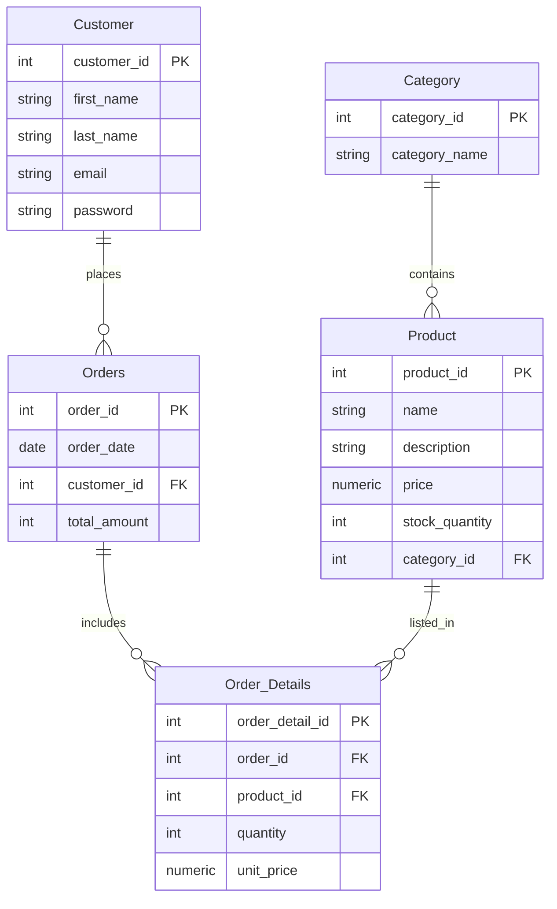

# E-Commerce Database Project

This project contains the SQL schema for a basic e-commerce system including:

- Categories
- Products
- Customers
- Orders
- Order Details

The schema is written using standard SQL and tested on SQL Server.

---

# 📁 **Database Schema (SQL)**

Below is the full SQL schema used in this project.

```sql
CREATE TABLE Category (
    category_id INTEGER,
    category_name VARCHAR(50),
    PRIMARY KEY (category_id)
);

CREATE TABLE Product (
    product_id INTEGER,
    name VARCHAR(50) NOT NULL,
    description VARCHAR(100) NOT NULL,
    price NUMERIC(5,2) NOT NULL CHECK (price >= 0),
    stock_quantity INTEGER NOT NULL CHECK (stock_quantity >= 0),
    category_id INTEGER NOT NULL,
    PRIMARY KEY (product_id),
    FOREIGN KEY (category_id) REFERENCES Category(category_id)
);

CREATE TABLE Customer (
    customer_id INTEGER,
    first_name VARCHAR(20) NOT NULL,
    last_name VARCHAR(20) NOT NULL,
    email VARCHAR(255) NOT NULL,
    password VARCHAR(30) NOT NULL,
    PRIMARY KEY (customer_id)
);

CREATE TABLE Orders (
    order_id INTEGER,
    order_date DATE NOT NULL,
    customer_id INTEGER NOT NULL,
    total_amount INTEGER NOT NULL DEFAULT 0,
    PRIMARY KEY (order_id),
    FOREIGN KEY (customer_id) REFERENCES Customer(customer_id)
);

CREATE TABLE Order_Details (
    order_detail_id INTEGER,
    order_id INTEGER NOT NULL,
    product_id INTEGER NOT NULL,
    quantity INTEGER NOT NULL CHECK (quantity > 0),
    unit_price NUMERIC(5,2) NOT NULL CHECK (unit_price >= 0),
    PRIMARY KEY (order_detail_id),
    FOREIGN KEY (order_id) REFERENCES Orders(order_id),
    FOREIGN KEY (product_id) REFERENCES Product(product_id)
);
```
---

# 🔗 Entity–Relationship Summary

Below is a summary of the relationships between entities:

1. Category → Product

Relationship: One-to-Many (1:N)

Meaning: Each category can contain multiple products.

2. Customer → Orders

Relationship: One-to-Many (1:N)

Meaning: A customer can place multiple orders.

3. Orders → Order_Details

Relationship: One-to-Many (1:N)

Meaning: Each order can contain multiple items.

4. Product → Order_Details

Relationship: One-to-Many (1:N)

Meaning: A product can appear in multiple order lines.

---

## 📌 Entity Relationship Diagram (ERD)


